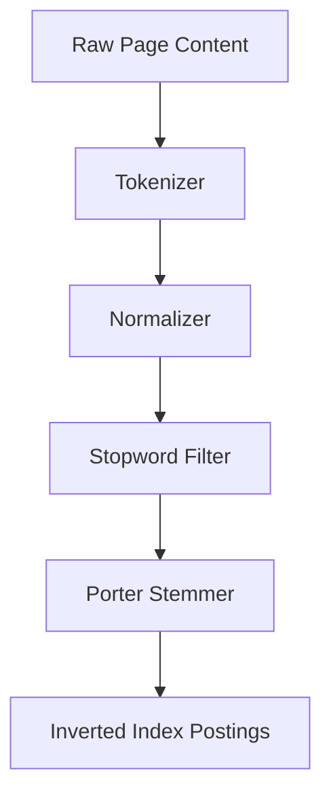

# Indexer Architecture & Data Flow

The `indexer` CLI processes raw crawled web pages, normalizes and stems their text content, computes compression deltas, and saves them into the inverted index postings table.

## 1. Text Processing Pipeline
The document indexing pipeline proceeds sequentially through four main stages:

### Tokenizer
* **Rules**: Splits raw strings on whitespace boundaries and punctuation characters.
* **Proximity Preservation**: Keeps track of the absolute word position index (offset) for each term, which is needed to enable exact phrase and proximity search.

### Normalizer
* Converts all tokens to lower case.
* Strips leading and trailing punctuation (e.g. `"hello,"` → `"hello"`), while preserving internal punctuation for compound words (e.g. `"state-of-the-art"`).
* Removes tokens that consist solely of numeric digits.

### Stopwords Filter
* Filters out ~150 high-frequency grammatical words (e.g. `the`, `is`, `at`, `which`, `on`) to save database index storage space and improve lookup efficiency.

### Porter Stemmer
* Implements the standard Porter Stemming Algorithm.
* Reduces morphological variants of a word to their common root form (e.g. `"running"`, `"runs"`, `"ran"` → `"run"`).

---

## 2. Inverted Index Compression

To keep index size compact and query latency sub-millisecond, positional tracking arrays are compressed:

### Delta-Encoding
Because term positions inside a document are strictly increasing, we store position values as *deltas* (offsets from the previous match) instead of raw integers.
* E.g., raw positions `[12, 15, 23]` are encoded as deltas `[12, 3, 8]`.

### Variable-Byte (VByte) Compression
Position deltas and document IDs are written as VByte-encoded byte sequences (`BYTEA` format in PostgreSQL):
* Numbers in the range `[0, 127]` fit in 1 byte.
* Numbers `[128, 16383]` fit in 2 bytes.
* The most significant bit (MSB) of each byte serves as a continuation flag (`1` indicates more bytes follow, `0` indicates termination).

---

## 3. Tiered Indexing & Segments
Postings are partitioned into segments:
* **Hot Segment**: Postings for pages crawled or updated in the last 30 days. Stored as `'hot'` in the DB postings table and prioritized for quick scans.
* **Cold Segment**: Postings for older historical documents.
* **Compaction**: A daily compaction script migrates older pages from hot to cold segments.
